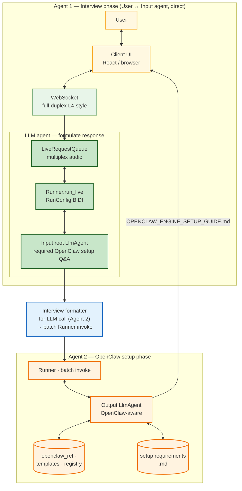
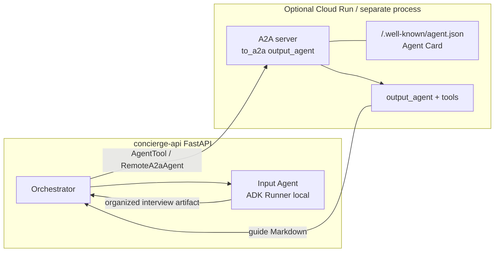

# Architecture decision: AI orchestration (OpenClaw Concierge V2.2 + Google ADK)

**Status:** Accepted (documentation)  
**Scope:** Runtime layout for transcript → structured contract → setup guide, aligned with the Master Specification V2.2, Implementation Guide, `AGENTS.md`, and [Way Back Home Level 4](https://codelabs.developers.google.com/way-back-home-level-4/instructions#0) patterns where applicable.

---

## 1. Context

OpenClaw Concierge is **multi-step AI orchestration**, not a single chat model:

- **Normative boundary:** `raw transcript` → **`INTERVIEW_CONTRACT.md`** (structured Markdown) → **`OPENCLAW_ENGINE_SETUP_GUIDE.md`**.
- **Handoff format:** The inter-agent artifact is **Markdown**, not JSON, in the **agent prompt path**. Research and practice suggest Markdown in LLM prompts/responses often uses **on the order of ~15% fewer tokens** than equivalent JSON, improving **cost and context efficiency**—and aligns with **Markdown-first** agent identity / prompt files.
- **Security:** Zero storage of user API keys; OAuth / Codex flows are **user-side** (Master Spec §5.1).
- **Registry:** `clawhub install <slug>` lines come from **`registry.md` / `skill_registry.md`** via **deterministic code** (tools or orchestration helpers), not from model recall.

Optional **live interview** is a **capture** path only; its artifact is still **plain-text transcript** into the same Input Agent entrypoint.

**`schema.json` role (updated):** Remains the **logical / typed model** of fields. Use it **optionally** by **parsing** `INTERVIEW_CONTRACT.md` → object → JSON Schema validation when strict typing is required. The **default gate** for calling the Output Agent is **Markdown contract validation** per [`interview_contract_spec.md`](interview_contract_spec.md).

---

## 2. Decision summary

| Topic | Decision |
|--------|-----------|
| **Root orchestrator** | **FastAPI service (deterministic, no LLM).** Owns HTTP, validation gates, correlation IDs, retries, and response shaping. |
| **Input Agent** | **ADK `root_agent` + ADK Runner (batch).** System instruction: `input_agent_prompt.md`. **Output:** `INTERVIEW_CONTRACT.md` per **`interview_contract_spec.md`** (required `##` sections). |
| **Validation gate** | **Primary:** structural checks on `INTERVIEW_CONTRACT.md`. **Optional:** parse → **`schema.json`** validate for strict deployments. |
| **Output Agent** | **ADK `root_agent` + ADK Runner (batch).** Receives the **Markdown contract** in context (not JSON). System instruction: `output_agent_prompt.md`. **ADK tools** expose registry rows, template sections, and `openclaw_ref.md` snippets so slugs stay grounded. |
| **Optional Interview** | **ADK Live / BIDI** (Way Back Home–style): React UI ↔ WebSocket ↔ `RunConfig` + `run_live` / `LiveRequestQueue`. Instruction: `system_knowledge_base/system_prompt.md`. **Export transcript** to the same `POST /v1/guide` pipeline. |
| **Optional scale-out** | **A2A** (`to_a2a` + Agent Card): host **Output Agent** (or Input) as a separate service; orchestrator calls via **Agent-as-a-Tool** / remote client—**not required** for MVP. |
| **Rejected** | **LLM “root orchestrator”** for routing a fixed linear pipeline (adds cost/latency without benefit). **Letting the Output model invent skill slugs** (violates invariants). **JSON as the only handoff** when Markdown meets the same structure with lower token cost. |

---

## 3. What “ADK Runner” is (and why it appears in the diagram)

The **ADK Runner** is the runtime that executes an ADK agent: **session lifecycle**, **model turns**, **tool execution** (model ↔ code ↔ model), and **event streaming** (including **live** modalities when using `run_live`).

- **Batch path (Input / Output):** One Runner invocation per step (or per retry) with text-in / text-out (plus tool calls).
- **Optional live path:** Same Runner concept with **BIDI** configuration and WebSocket bridging, per Way Back Home Level 4 `main.py` patterns.

The **orchestrator** remains outside ADK: it **calls** Runners; it does not replace them.

---

## 4. Complete working orchestration layout

### 4.1 Control flow (normative)

1. **Ingress:** Transcript from UI **or** end of optional Live session.  
2. **Orchestrator:** Validate transcript (non-empty, max size, encoding); assign **correlation id**.  
3. **Input Agent (ADK):** Transcript → **`INTERVIEW_CONTRACT.md`**; optional **RAG tool** over `domain_knowledge/` (non-normative).  
4. **Gate:** Validate contract **Markdown** (required sections per `interview_contract_spec.md`). Optionally **parse → `schema.json`** validate. On failure: bounded **retry**; else 4xx/structured error.  
5. **Output Agent (ADK):** Validated **contract .md** in prompt → guide; tools supply **resolved slugs**, **template skeleton**, **reference snippets**; model writes **prose** per Master Spec §5.  
6. **Egress:** `{ "guide_markdown": "...", "contract_version": "..." }` (and optional `schema_version` if parsed); UI preview + download.

### 4.2 Artifact and knowledge map

| Artifact / path | Consumer |
|-----------------|----------|
| `input_agent_prompt.md` | Input Agent |
| **`interview_contract_spec.md`** | Input + orchestrator (structure); **normative section list** |
| **`INTERVIEW_CONTRACT.md`** | Output Agent (primary context); orchestrator (validate) |
| `schema.json` | **Optional** parse-then-validate; tests; codegen |
| `output_agent_prompt.md` | Output Agent |
| `registry.md` / `system_knowledge_base/skill_registry.md` | Deterministic resolver (tool or orchestration module) |
| `smart_markdown_templates.md` | Output Agent tool / template merge |
| `openclaw_ref.md` | Output Agent tool |
| `system_knowledge_base/system_prompt.md` | Optional Interview Agent only |
| `system_knowledge_base/domain_knowledge/*.md` | Interview scope + optional Input RAG |

### 4.3 Suggested repository layout (when code exists)

```text
backend/
  main.py                 # FastAPI: orchestrator endpoints
  orchestration/
    pipeline.py           # validate -> run_input -> validate_contract_md -> run_output
    contract_validate.py  # section checks + optional parse -> schema.json
    registry_loader.py    # parse registry.md / skill_registry.md
  agents/
    input_agent/          # adk create input_agent
    output_agent/         # adk create output_agent
    interview_agent/      # optional: Live / BIDI
  artifacts/              # prompts, interview_contract_spec.md, optional schema.json
frontend/                   # transcript UI; optional WebSocket client for Live
system_knowledge_base/      # content track (see Master Execution Blueprint)
```

---

## 5. Figure A — End-to-end ADK + orchestration (logical)

**This figure (only):** **Two ADK agents**, **no validation** between them — an **interview formatter** shapes the payload for **Agent 2** and **feeds batch `Runner` invoke** directly.

- **User → Input agent:** The user converses **only** with the **Input root `LlmAgent`** (Agent 1). Transport matches [Way Back Home Level 4 §4](https://codelabs.developers.google.com/way-back-home-level-4/instructions#4): **client ↔ WebSocket**, **`LiveRequestQueue`** as the multimodal buffer, **`Runner.run_live`** with **`RunConfig`** and **`StreamingMode.BIDI`** for **bi-directional** audio/video/text (same ADK orchestration model as `main.py` in that codelab).
- **Stream + batch:** The live stream drives the root agent; **batch-style work** runs as **tools** (e.g. **`FunctionTool`**, **`AgentTool`**) — domain **knowledge base**, **use cases**, and reads of a **setup requirements Markdown** file — without a second conversational surface for the user.
- **Agent 2 — OpenClaw setup phase:** **Interview formatter** → **batch `Runner`** invoke (direct link); **Output `LlmAgent`** uses **OpenClaw context** (e.g. `openclaw_ref`, templates, **registry**); primary artifact **`OPENCLAW_ENGINE_SETUP_GUIDE.md`**.

**Source file (for CLI export):** [`diagrams/end-to-end-adk-orchestration.mmd`](diagrams/end-to-end-adk-orchestration.mmd)  
**Rendered PNG:** [`diagrams/end-to-end-adk-orchestration.png`](diagrams/end-to-end-adk-orchestration.png)



---

## 6. Figure B — Optional extension: Output Agent as A2A service

Use when splitting deployables (Cloud Run service for Output only). Pattern matches Way Back Home **Architect** server + **Agent Card**.



---

## 7. Way Back Home alignment (Master Spec section 8)

| Way Back Home | This design (Figure A) |
|----------------|------------------------|
| [Level 4 §4 — multimodal live + BIDI](https://codelabs.developers.google.com/way-back-home-level-4/instructions#4) (WebSocket, `LiveRequestQueue`, `run_live`, `RunConfig` / **BIDI**) | **Agent 1** interview path — **user talks directly to Input root agent** over the same **streaming ADK** shape |
| Level 4 — **Agent-as-a-Tool** / dispatch patterns | **Batch** side of Agent 1 = **tools** (including optional **`AgentTool`**) for KB / use cases, not a second user-facing agent |
| Architect + strict tools | **Agent 2** tools = registry / templates / `openclaw_ref` (curated files) |
| Remote services | **Optional** Output via A2A (Figure B) |

---

## 8. Regenerating the PNG from the `.mmd` file

```bash
cd /path/to/install-openclaw
npx -y @mermaid-js/mermaid-cli@11.4.0 \
  -i Documentations/diagrams/end-to-end-adk-orchestration.mmd \
  -o Documentations/diagrams/end-to-end-adk-orchestration.png \
  -b white -w 3000 -H 2200
```

---

## 9. References (in-repo)

- [Project Master Specification (V2.2)](Project%20Master%20Specification%20(V2.1)_%20OpenClaw%20Concierge%20Technical%20Architecture.md)
- [Interview contract spec (`INTERVIEW_CONTRACT.md`)](interview_contract_spec.md)
- [Claude Code Implementation Guide](Claude%20Code%20Implementation%20Guide_%20OpenClaw%20Concierge%20(1).md)
- [AGENTS.md](AGENTS.md)

---

*Amended (2026-03-22): Inter-agent handoff is **Markdown-first** (`INTERVIEW_CONTRACT.md`); `schema.json` optional after parse. Token-efficiency rationale documented.*
