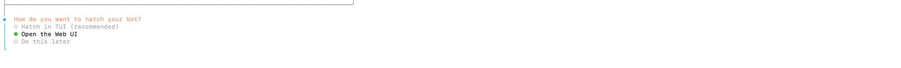
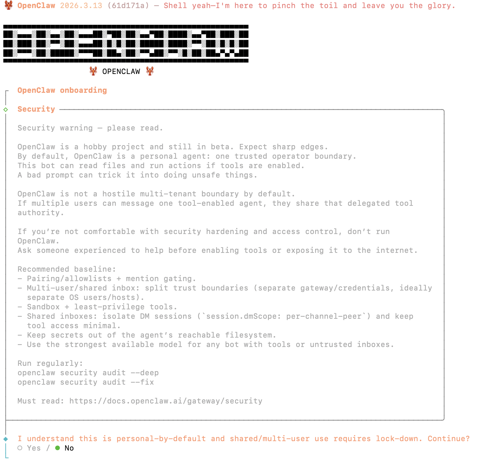
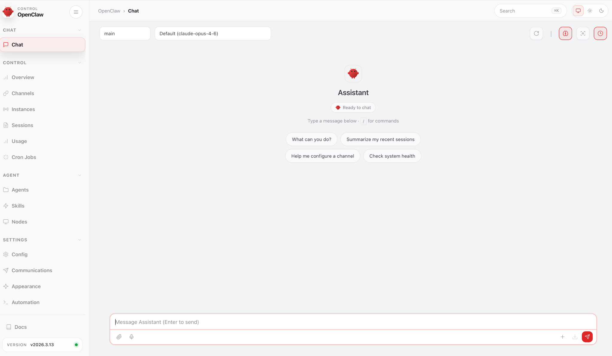

# OPENCLAW ENGINE SETUP GUIDE

**Your Agent. Your Hardware. Your Soul.**

| | |
|---|---|
| **PREPARED FOR** | Jordan — Coffee Shop Owner |
| **MISSION** | End scheduling chaos. Know who is on shift, who is off, and what needs covering — without a single group chat fire drill. |
| **DATE** | 2026-03-26 |
| **DEPLOYMENT** | Existing Mac |
| **CHANNEL** | WhatsApp |
| **MODEL** | Anthropic Claude (claude-sonnet-4-20250514) |
| **STATUS** | [ INITIALIZING DEPLOYMENT ] |

---

**Jordan, your scheduling chaos ends here — this guide gives you a WhatsApp-connected AI assistant that knows your coffee shop's roster, sends shift reminders automatically, and gives you a daily briefing every morning before you unlock the door.**

---

## 🎯 Key Moments — What You Will Accomplish

By the end of this guide, you will have:

- **A running OpenClaw instance** on your Mac, connected to WhatsApp and ready to answer scheduling questions 24 hours a day while your Mac is awake
- **2 tailored automations** that send a morning shift briefing and an end-of-day coverage check without you lifting a finger
- **Business-grade guardrails** ensuring your agent stays in its lane — it informs you and your team, but never makes roster changes on its own

---

## 00 | ✅ PRE-FLIGHT CHECKLIST

> ✅ **ACTION:** Complete every item below **before** running a single command. Missing prerequisites will cause you to backtrack.

### Accounts to Create

- [ ] **Anthropic account** — Create at [console.anthropic.com](https://console.anthropic.com). You need an API key. Set a monthly spending limit of **$20** to start — that is more than enough for a coffee shop use case.
- [ ] **WhatsApp** — You already have this. Consider registering a **second phone number** (e.g., a cheap SIM or Google Voice) specifically for your OpenClaw bot. This keeps your personal messages separate from bot messages. (Optional, but recommended.)

### API Keys to Obtain

- [ ] **Anthropic API Key** — In the Anthropic console: API Keys → Create Key. Copy it and save it in your password manager immediately. You will not be shown it again.

### Hardware & Software

- [ ] Mac running macOS 13 Ventura or later (macOS 14 Sonoma or 15 Sequoia recommended)
- [ ] At least 8 GB RAM and 2 GB free disk space
- [ ] Mac is plugged in to power (important — sleep mode will pause your automations)
- [ ] Terminal app open (find it via Spotlight: press `⌘ Space` and type "Terminal")

> 💡 **TIP:** Jordan, gather your Anthropic API key and have it copied to your clipboard before you start Section 02. This prevents you from losing your place mid-setup.

---

## 01 | 🖥️ PLATFORM SETUP

Jordan, these steps prepare your Mac to run OpenClaw reliably every day.

> ⚠️ **WARNING:** Your Mac must **not** fall asleep while automations are scheduled to run. A Mac that sleeps at 7 AM will miss your morning shift briefing. Section 1B covers how to prevent this.

### 1A — Install Xcode Command Line Tools

This installs the software compilers OpenClaw needs. Paste this into Terminal and press Enter:

```bash
xcode-select --install
```

A dialog box will appear. Click **"Install"** (not "Get Xcode"). Wait for it to finish — it takes 2–5 minutes.

**Verify it worked:**
```
$ xcode-select -p
/Library/Developer/CommandLineTools   ← you should see this path
```

### 1B — Configure Sleep Settings

> 💡 **TIP:** Why this matters for you: a Mac that sleeps will miss your 7 AM shift briefing cron job, and your team's WhatsApp messages to the bot will go unanswered. Keep your Mac awake while plugged in.

**For Mac desktops (iMac, Mac mini, Mac Studio):** Run this in Terminal:

```bash
sudo pmset -c sleep 0 displaysleep 10
```

This prevents system sleep when plugged in, but lets the screen sleep after 10 minutes (saves power).

**For MacBooks:** Install the free app [Amphetamine](https://apps.apple.com/us/app/amphetamine/id937984704) from the App Store. Then:
1. Open Amphetamine → Preferences → Triggers
2. Create trigger: "While OpenClaw is running"
3. Condition: Application "node" is running
4. Check "Allow display to sleep" (screen can still sleep — the bot doesn't need it)
5. Set "Allow system sleep on battery after 30 minutes" as a safety net

**Verify it worked (desktops):**
```
$ pmset -g | grep "sleep"
sleep                1  (sleep: 0 means sleep disabled on AC)
```

### 1C — Install Homebrew

Homebrew is a package manager for macOS. You'll use it to install Node.js:

```bash
/bin/bash -c "$(curl -fsSL https://raw.githubusercontent.com/Homebrew/install/HEAD/install.sh)"
```

Follow the instructions it prints at the end (it will ask you to run 2 more commands to add Homebrew to your PATH — do those too).

**Verify it worked:**
```
$ brew --version
Homebrew 4.x.x   ← any recent version is fine
```



---

## 02 | 📦 INSTALL OPENCLAW

### 2A — Install Node.js

```bash
brew install nvm
```

Then follow the output instructions to add nvm to your shell (it will show you two lines to paste into `~/.zshrc`). After doing that, run:

```bash
source ~/.zshrc
nvm install 24
nvm use 24
nvm alias default 24
```

**Verify it worked:**
```
$ node --version
v24.x.x   ← must be v22.16 or higher (v24 is recommended)
```

### 2B — Run the OpenClaw Installer

```bash
curl -fsSL https://get.openclaw.ai | bash
```

**Verify it worked:**
```
$ openclaw --version
openclaw v2026.x.x   ← any version 2026.1.29 or later
```

> ⚠️ **WARNING:** You need version **2026.1.29 or later**. Earlier versions had a security gap allowing unauthenticated gateway access. If you see an older version, re-run the installer above.

### 2C — Run the Onboarding Wizard

```bash
openclaw onboard --install-daemon
```

This interactive wizard will walk you through setup step by step. At each prompt, choose:

| Prompt | What to Choose |
|---|---|
| Gateway mode | **Local** |
| AI provider | **Anthropic** — paste your API key when asked |
| Model | **`claude-sonnet-4-20250514`** — best balance of speed and cost for a coffee shop |
| Messaging channels | **WhatsApp** — you'll finish the connection in Section 03 |
| Hooks | Enable **session memory**, **boot hook**, and **command logger** |
| Skills | **Skip for now** — you'll install skills carefully in Section 05 |
| Install daemon? | **Yes** — this makes OpenClaw start automatically when your Mac turns on |



> ✅ **ACTION:** When the wizard shows the security acknowledgment, select **"Yes"** to confirm you are the sole operator.

**Verify everything is running:**
```
$ openclaw gateway status
Gateway: running   Port: 18789   Model: anthropic/claude-sonnet-4-20250514
```

---

## 03 | 📱 CONNECT YOUR CHANNEL (WHATSAPP)

Jordan, this step connects your agent to WhatsApp so you can message it from your phone, and so it can send your team shift reminders.

> 💡 **TIP:** Why this matters: WhatsApp is how you and your team already communicate. Putting the scheduling agent there means zero change to your team's habits — they just message the bot the same way they message you.

### 3A — Install the WhatsApp Plugin

```bash
openclaw plugins install @openclaw/whatsapp
```

**Verify it worked:**
```
$ openclaw plugins list
@openclaw/whatsapp   ✓ installed
```

### 3B — Log In to WhatsApp

```bash
openclaw channels login --channel whatsapp
```

This will display a **QR code** in your terminal. On your phone:
1. Open WhatsApp → Settings → Linked Devices
2. Tap **"Link a Device"**
3. Scan the QR code shown in Terminal

**Verify it worked:**
```
$ openclaw channels status
whatsapp   ✓ connected   linked account: +1XXXXXXXXXX
```

### 3C — Lock Down Access (CRITICAL)

> ⚠️ **WARNING:** Without this step, anyone who discovers your bot's WhatsApp number can send it commands. Always restrict access to your number only.

Edit your config file (`~/.openclaw/config.yaml` or `~/.openclaw/openclaw.json`) and add:

```json5
{
  channels: {
    whatsapp: {
      dmPolicy: "allowlist",
      allowFrom: ["+1YOURNUMBER"],   // Replace with your E.164 phone number, e.g. "+15551234567"
      groupPolicy: "allowlist",
      groupAllowFrom: ["+1YOURNUMBER"],
    },
  },
}
```

Then reload:
```bash
openclaw gateway reload
```

> ✅ **ACTION:** Test by sending "Hello" to your bot from your personal WhatsApp number. It should respond. Then ask a colleague to try — they should get no response (or a pairing request, which you can decline).


---

## 04 | 🧠 CONFIGURE YOUR MODEL PROVIDER (ANTHROPIC)

Check that your model provider is active:

```bash
openclaw models status
```

**Verify it worked:**
```
Provider: anthropic   Status: ✓ active   Model: claude-sonnet-4-20250514
```

If not configured, run:
```bash
openclaw onboard --provider anthropic --api-key "YOUR_ANTHROPIC_API_KEY"
```

> 💡 **TIP:** Jordan, set a monthly spending cap of **$20** in your [Anthropic console](https://console.anthropic.com) under Billing → Usage Limits. Typical usage for a coffee shop scheduling assistant is **$3–8/month** with Claude Sonnet. You are nowhere near $20.

Store your API key securely in the macOS Keychain instead of plain text:

```bash
openclaw secret set anthropic_key "YOUR_ANTHROPIC_API_KEY"
```

Then update your config to reference the secret instead:
```yaml
# In ~/.openclaw/config.yaml
models:
  - provider: anthropic
    api_key: ${{ secret.anthropic_key }}
    model: claude-sonnet-4-20250514
```


---

## 05 | 🔧 INSTALL SKILLS

> ⚠️ **WARNING:** Always install `skill-vetter` first and use it to screen every skill before installing. Approximately 17–20% of community skills contain suspicious code. No exceptions — even skills that look trustworthy.

### Phase 1: Security Stack (Install First — No Exceptions)

```bash
clawhub install skill-vetter
```

**Verify it worked:**
```
$ openclaw skills list
skill-vetter   v1.x.x   ✓ active
```

Now use skill-vetter to screen and install the security skills:

```bash
skill-vetter prompt-guard
clawhub install prompt-guard

skill-vetter agentguard
clawhub install agentguard
```

**Verify all three are active:**
```
$ openclaw skills list
skill-vetter   v1.x.x   ✓ active
prompt-guard   v1.x.x   ✓ active
agentguard     v1.x.x   ✓ active
```

### Phase 2: Core Coffee Shop Skills

| Your Need | Skill | What It Does |
|---|---|---|
| Manage staff schedules & shifts | `gog` | Full Google Calendar integration — your agent can read and understand your roster in real time |
| Send shift reminders | `whatsapp-styling-guide` | Ensures all automated WhatsApp messages look professional and brand-consistent |
| Build multi-step automations | `automation-workflows` | Design "if X then Y" automations without writing code — e.g., if a shift is uncovered, alert Jordan |
| macOS reminders for opening tasks | `apple-reminders` | Create and manage Apple Reminders from chat — syncs across all your Apple devices |

```bash
skill-vetter gog
clawhub install gog

skill-vetter whatsapp-styling-guide
clawhub install whatsapp-styling-guide

skill-vetter automation-workflows
clawhub install automation-workflows

skill-vetter apple-reminders
clawhub install apple-reminders
```

> ✅ **ACTION:** After installing `gog`, run `openclaw skills configure gog` and follow the OAuth prompts to connect your Google account. This gives the agent read access to your Google Calendar where your staff schedule lives.

**Verify all skills are active:**
```
$ openclaw skills list
skill-vetter           v1.x.x   ✓ active
prompt-guard           v1.x.x   ✓ active
agentguard             v1.x.x   ✓ active
gog                    v1.x.x   ✓ active
whatsapp-styling-guide v1.x.x   ✓ active
automation-workflows   v1.x.x   ✓ active
apple-reminders        v1.x.x   ✓ active
```

> ☕ **COFFEE SHOP NOTE:** The `gog` skill reads your Google Calendar — your current roster app, spreadsheet, or any system you use. If your schedule lives in a Google Sheet instead of Google Calendar, the `gog` skill covers Sheets too. You don't need to change your existing workflow.

---

## 06 | ⚡ CONFIGURE AUTOMATIONS

> 💡 **TIP:** Why this matters: these automations replace the manual "who's on today?" chaos you described. Every morning at 7 AM, before you open, you'll know exactly who is coming in — without firing up a group chat.

### Automation 1 — Morning Shift Briefing

**What it does:** Every morning at 7:00 AM, the agent checks your Google Calendar for today's shift roster and sends you a structured WhatsApp summary: who is on, what time they start, and whether any shift is uncovered.

**Autonomy Tier: 🔔 NOTIFY** — Agent reads and summarises. Takes no action, sends nothing to staff. Only you see this message.

Replace `+1YOURNUMBER` with your WhatsApp number in E.164 format before running:

```bash
openclaw cron add \
  --name "Morning Shift Briefing" \
  --cron "0 7 * * *" \
  --tz "America/New_York" \
  --session isolated \
  --message "Check today's shift roster from Google Calendar. Summarise: (1) who is scheduled and their start times, (2) any gaps or uncovered shifts, (3) any notes added to calendar events. Format as a clear WhatsApp message. Keep it short — I read this before I open the shop." \
  --announce \
  --channel whatsapp \
  --to "+1YOURNUMBER"
```

> ✅ **ACTION:** Replace `America/New_York` with your timezone. Common options: `America/Los_Angeles`, `America/Chicago`, `Europe/London`, `Australia/Sydney`. Find your full timezone name at [en.wikipedia.org/wiki/List_of_tz_database_time_zones](https://en.wikipedia.org/wiki/List_of_tz_database_time_zones).

**Verify it was created:**
```
$ openclaw cron list
ID   Name                     Schedule      Timezone           Status
1    Morning Shift Briefing   0 7 * * *     America/New_York   ✓ active
```

**Test it immediately (don't wait until tomorrow morning):**
```bash
openclaw cron run 1
```

---

### Automation 2 — End-of-Day Coverage Check

**What it does:** Every day at 4:00 PM, the agent checks tomorrow's roster for any uncovered shifts or gaps and alerts you via WhatsApp, while there is still time to sort cover.

**Autonomy Tier: 🔔 NOTIFY** — Agent reads and alerts. Takes no action.

```bash
openclaw cron add \
  --name "End-of-Day Coverage Check" \
  --cron "0 16 * * *" \
  --tz "America/New_York" \
  --session isolated \
  --message "Check Google Calendar for tomorrow's shifts. Flag any uncovered shifts, staff calling in sick (check for any cancellation notes), or gaps where we'll be short-staffed. If everything is covered, say so clearly. Send a brief WhatsApp alert." \
  --announce \
  --channel whatsapp \
  --to "+1YOURNUMBER"
```

**Verify it was created:**
```
$ openclaw cron list
ID   Name                       Schedule      Timezone           Status
1    Morning Shift Briefing     0 7 * * *     America/New_York   ✓ active
2    End-of-Day Coverage Check  0 16 * * *    America/New_York   ✓ active
```

> ☕ **COFFEE SHOP NOTE:** Both automations are NOTIFY-tier. Your agent will never message your staff directly, never edit your calendar, and never make roster decisions. It only tells **you** what it sees. You stay in control of every scheduling decision.

---

## 07 | 💉 INJECT YOUR SOUL

> ✅ **ACTION:** Open `prompts_to_send.md` (in the same folder as this guide) and paste each prompt into the OpenClaw chat interface **one at a time**, in order. Wait for the agent to respond to each before sending the next.

Open the dashboard:
```bash
openclaw dashboard
```

Your browser will open at `http://127.0.0.1:18789`. You will see a chat interface. This is where you paste the prompts.

**Prompt sequence:**
1. **Identity Prompt** → tells the agent who it is and what it is here for
2. **Scheduling Workflow Prompt** → teaches the agent your coffee shop's specific roster patterns
3. **Guardrails Prompt** → defines firm limits on what the agent is allowed to do autonomously
4. **Security Audit Prompt** → final verification before you go live

> 💡 **TIP:** Wait for the agent to acknowledge each prompt before sending the next. A simple response like "Understood, I'll keep that in mind" is enough — it means the layer has been absorbed.



---

## 08 | 🔒 SECURITY HARDENING

> ⚠️ **WARNING:** Jordan, do not skip this section. Your coffee shop's WhatsApp number, staff contacts, and daily schedule are all accessible to your agent. A poorly secured instance is a liability — both for your business and your staff's privacy.

### Mac-Specific Hardening

**Enable FileVault disk encryption** (if not already on):
```bash
fdesetup status
```
If it says "FileVault is Off," enable it: System Settings → Privacy & Security → FileVault → Turn On. This encrypts your disk so your API keys and session data are protected if your Mac is lost or stolen.

**Use macOS Keychain for all secrets** (you set this up in Section 04):
```bash
# Verify your key is stored in Keychain, not plain text
cat ~/.openclaw/config.yaml | grep api_key
# Should show: api_key: ${{ secret.anthropic_key }}   NOT a real key
```

**Enable sandboxing** — prevents the agent from accessing your personal files:
```bash
openclaw config patch '{"sandbox": {"enabled": true, "mode": "workspace", "workspace_root": "~/.openclaw/workspaces", "per_sender": true}}'
openclaw gateway reload
```

**Restrict tools to what you actually need:**
```bash
openclaw config patch '{"tools": {"allow": ["file_read", "web_search", "calculator", "datetime", "memory_store", "memory_recall"], "deny": ["shell_exec", "file_delete"]}}'
openclaw gateway reload
```

**Set up daily gateway restart** to prevent memory buildup overnight:
```bash
openclaw cron add \
  --name "Daily Gateway Restart" \
  --cron "0 4 * * *" \
  --tz "America/New_York" \
  --session isolated \
  --message "Perform daily maintenance restart check." \
  --announce
```

### Coffee Shop Security Checklist

- [ ] FileVault enabled on your Mac
- [ ] API key stored in macOS Keychain (not plain text in config)
- [ ] WhatsApp `allowFrom` restricted to your number only
- [ ] Sandbox enabled — agent cannot access your personal files
- [ ] `shell_exec` and `file_delete` tools disabled
- [ ] Anthropic API spending cap set to $20/month in console
- [ ] OpenClaw conversation logs retained in `~/.openclaw/` (audit trail)
- [ ] API key to be rotated every 90 days (set a reminder in Apple Reminders now)
- [ ] Staff phone numbers **not** stored in bot config — only your number is in `allowFrom`

---

## 09 | 🔍 SECURITY AUDIT CHECKLIST

> ✅ **ACTION:** Run this full audit before using OpenClaw for real scheduling operations.

```bash
openclaw security audit --deep
```

**Verify it worked:**
```
Security Audit Complete
Critical warnings: 0
Recommendations: X (review below)
```

If there are critical warnings:
```bash
openclaw security audit --fix
openclaw doctor
openclaw health
```

**Manual verification — check each item:**
- [ ] `openclaw security audit --deep` completes with 0 critical warnings
- [ ] Gateway shows "running" with token authentication active
- [ ] `openclaw cron list` shows exactly the 3 jobs you configured — no unexpected entries
- [ ] `openclaw skills list` matches exactly what you installed in Section 05 (7 skills)
- [ ] WhatsApp bot only responds to your number
- [ ] No API keys stored in plain text: `grep -r "sk-ant" ~/.openclaw/` should return nothing
- [ ] FileVault is on: `fdesetup status` shows "FileVault is On"
- [ ] Review skill permissions: `openclaw skills list --verbose`

**Do NOT begin live scheduling operations until all checks pass.**

---

## 10 | 🚀 TROUBLESHOOTING & NEXT STEPS

### Common Issues

**"command not found: openclaw" after installing**
```bash
source ~/.zshrc
```

**Gateway not responding**
```bash
openclaw doctor
openclaw gateway stop && openclaw gateway start
```

**WhatsApp bot not responding**
- Verify it's linked: `openclaw channels status`
- Check logs: `openclaw logs --follow`
- Re-link if needed: `openclaw channels login --channel whatsapp`
- Confirm your number is in `allowFrom` in your config

**Cron jobs not firing**
- Verify gateway is running: `openclaw gateway status`
- Confirm cron is active: `openclaw cron list`
- Test a job manually: `openclaw cron run <job-id>`
- Check your Mac did not sleep: if it did, the cron job was skipped — this is expected behaviour

**WhatsApp session disconnects after Mac sleep**
```bash
openclaw channel restart whatsapp
openclaw channels status
```

**Memory growing over time**
```bash
openclaw gateway restart
openclaw session prune --older-than 7d
```

### Next Steps After a Stable Week

Once you have run the system for 1–2 weeks, Jordan, consider:

1. **Add a team-facing shift reminder** — once you're comfortable, configure the agent to send a scheduled WhatsApp message to your staff group the evening before their shift (upgrade to Tier 2: SUGGEST before escalating to Tier 3: EXECUTE)
2. **Connect a cover request workflow** — use `automation-workflows` to build a flow where if a shift is flagged as uncovered, the agent drafts a WhatsApp message to your on-call staff for you to review and send
3. **Context hygiene** — after week 5, use a separate OpenClaw session for customer-facing FAQ automation (common coffee shop questions: hours, wifi password, menu) so your scheduling context stays clean

---

## QUICK REFERENCE

| Item | Details |
|---|---|
| **Web UI URL** | `openclaw dashboard` (opens at http://127.0.0.1:18789) |
| **Gateway Port** | 18789 |
| **Model Provider** | Anthropic (`claude-sonnet-4-20250514`) |
| **Channel** | WhatsApp |
| **Config File** | `~/.openclaw/config.yaml` |
| **Cron Timezone** | Your local timezone (set in Section 06) |
| **OpenClaw Docs** | https://docs.openclaw.ai |
| **Security Audit** | `openclaw security audit --deep` |
| **Logs** | `openclaw logs --follow` |
| **Gateway Status** | `openclaw gateway status` |
| **Cron Jobs** | `openclaw cron list` |
| **Installed Skills** | `openclaw skills list` |
| **Restart Gateway** | `openclaw gateway restart` |
| **Re-link WhatsApp** | `openclaw channels login --channel whatsapp` |

---

**OPENCLAW | Your Agent. Your Hardware. Your Soul.**

---
