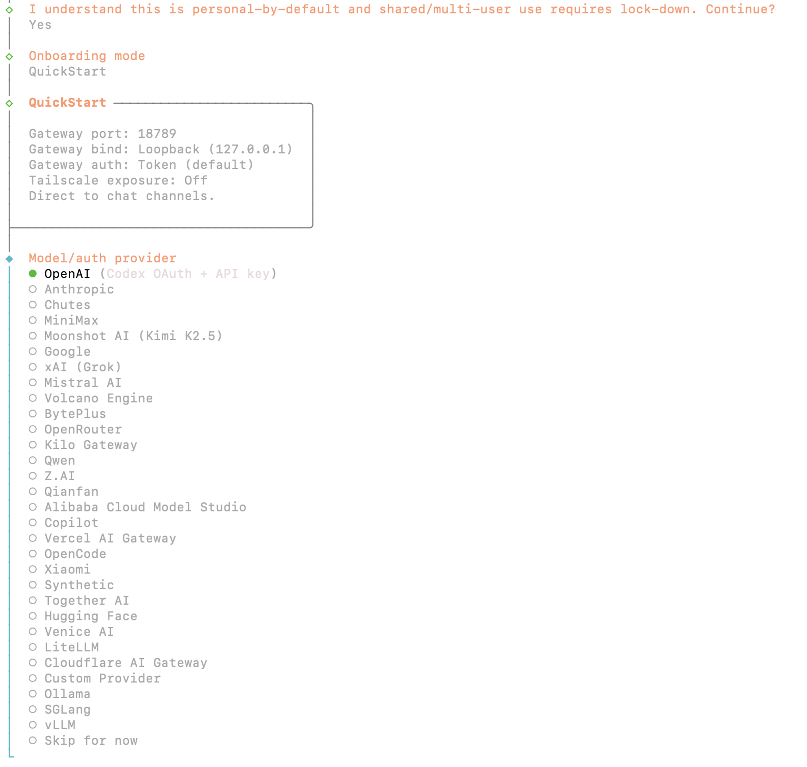
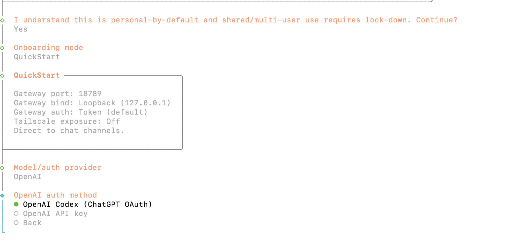
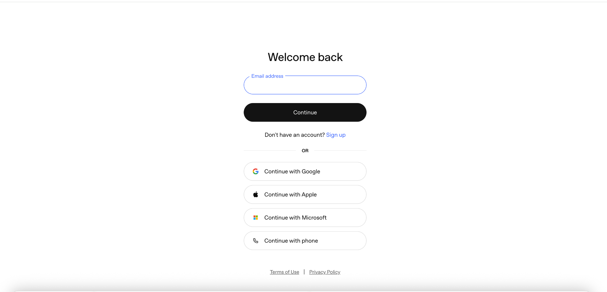
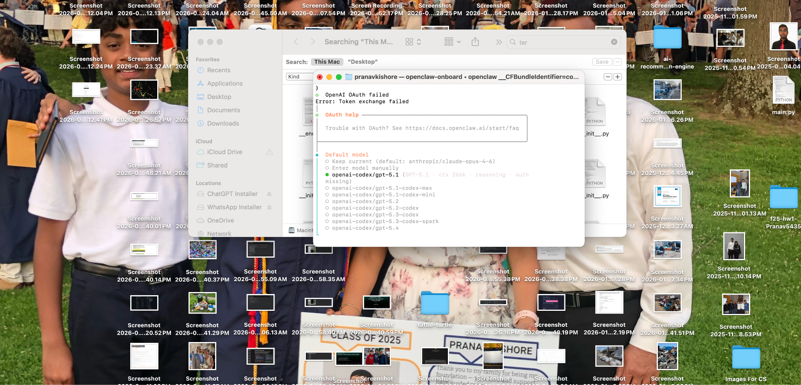
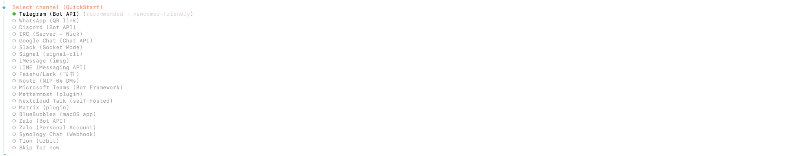
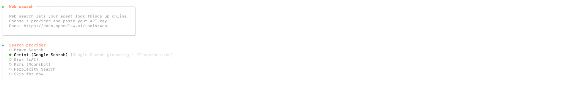
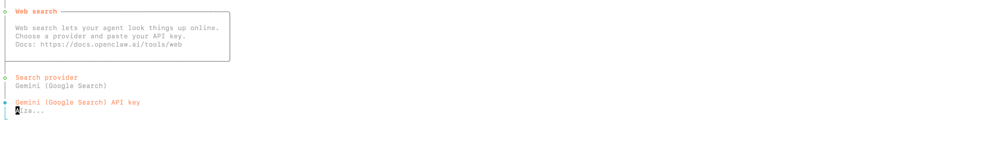

# OPENCLAW ONBOARDING GUIDE

**Your Agent. Your Hardware. Your Soul.**

| | |
|---|---|
| **PREPARED FOR** | {{user_name}} |
| **MISSION** | {{primary_pain_point}} |
| **DATE** | {{date}} |
| **STATUS** | [ INITIALIZING DEPLOYMENT ] |

---

## 00 | PRE-FLIGHT CHECKLIST

Before you begin, ensure you have the following ready:

- [ ] OpenAI Account (for Codex OAuth)
- [ ] Telegram Account (for channel)
- [ ] Google Gemini API Key (for web search)
- [ ] Terminal access on your machine

---

## 01 | THE SECURITY HANDSHAKE

When you launch `openclaw-onboard` in your terminal, OpenClaw greets you with its security manifesto. This establishes the "Personal-by-Default" boundary.

> OpenClaw is designed for a single trusted operator. Read the security recommendations carefully.

**ACTION:** Select "Yes" to acknowledge and continue. You are now the sole operator of this boundary.

---

## 02 | SELECTING YOUR MODEL PROVIDER

OpenClaw supports multiple AI providers. We recommend OpenAI Codex for the most reliable reasoning capabilities.

**ACTION:** Select "OpenAI" from the list of providers.

### Authentication Method

Choose how to authenticate with OpenAI. The Codex (ChatGPT OAuth) option is the fastest QuickStart method.

**ACTION:** Select "OpenAI Codex (ChatGPT OAuth)" for the fastest setup.

### OpenAI Login

A browser window will open for you to authenticate with your OpenAI/ChatGPT account.

**ACTION:** Sign in with your OpenAI account credentials (email, Google, Apple, or Microsoft).

### Model Selection

After authentication, select your preferred model. We recommend gpt-5.2-codex for the best balance of speed and capability.

**ACTION:** Select "openai-codex/gpt-5.2-codex" or your preferred model.

---

## 03 | CONNECTING YOUR CHANNEL

Your agent needs a place to communicate with you. We recommend Telegram for its stability, ease of use, and excellent bot API.

**ACTION:** Select "Telegram (Bot API)" from the channel list.

### Telegram BotFather Protocol

Follow these steps to create your Telegram bot:

1. Open Telegram and search for **@BotFather**
2. Send the command `/newbot`
3. Follow the prompts to name your bot
4. Copy the API Token provided by BotFather
5. Paste the token back into your terminal when prompted

> **Your Telegram Bot Token:** ____________________

---

## 04 | SEARCH CONFIGURATION

To allow your agent to search the web, we configure a search provider. We recommend Gemini (Google Search) for reliable, AI-synthesized results.

**ACTION:** Select "Gemini (Google Search)" from the search provider list.

### API Key Entry

Enter your Gemini API key. You can get one from the Google AI Studio (aistudio.google.com).

**ACTION:** Paste your Gemini API key and press Enter.

---

## 05 | SKILLS & HOOKS CONFIGURATION

OpenClaw supports optional skills and hooks that extend your agent's capabilities. For initial setup, we recommend skipping these.

### Skill Dependencies

Skills like 1password, apple-notes, obsidian, and more can be installed later.

**ACTION:** Select "Skip for now" to continue. Skills can be configured later via the Web UI.

### Enable Hooks

Hooks allow your agent to perform actions on boot, log commands, and maintain session memory.

**ACTION:** Select "Skip for now" or enable specific hooks based on your needs.

---

## 06 | HATCHING YOUR AGENT

This is the final terminal step. We're now moving from the command line to the OpenClaw Web UI.

**ACTION:** Select "Open the Web UI" to launch your agent's control panel.

---

## 07 | THE OPENCLAW WEB UI

Your browser will open to (example: `127.0.0.1:18789`) where your OpenClaw control panel lives.

> **STATUS: READY FOR INJECTION**

### Web UI Features

| Feature | Description |
|---|---|
| **Chat** | Direct conversation with your agent |
| **Channels** | Manage Telegram, Discord, and other connections |
| **Agents** | Configure agent behaviors and skills |
| **Sessions** | View conversation history and logs |
| **Config** | Advanced settings and API configurations |

---

## 08 | THE AGENT 2 HANDOFF

With the Web UI running, Agent 2 now takes over to inject your personalized configuration. Paste in the files it gives you.

### What Happens Next

1. Agent 2 receives your `SOUL.md` and `openclaw.json` configuration files
2. These files are injected into your local OpenClaw environment
3. Your Personal Assistant appears in the chat, pre-loaded with logic to solve your specific pain point

### Your Configuration

| Field | Value |
|---|---|
| **SOUL.md Location** | ____________________ |
| **openclaw.json Location** | ____________________ |
| **Primary Pain Point** | ____________________ |
| **First Automation Target** | ____________________ |

---

## QUICK REFERENCE

| Item | Details |
|---|---|
| **Web UI URL** | `http://127.0.0.1:18789` |
| **Gateway Port** | 18789 |
| **Model Provider** | OpenAI (Codex OAuth) |
| **Search Provider** | Gemini (Google Search) |
| **Documentation** | https://docs.openclaw.ai |
| **Security Audit** | `openclaw security audit --deep` |

---

**OPENCLAW | Your Agent. Your Hardware. Your Soul.**
