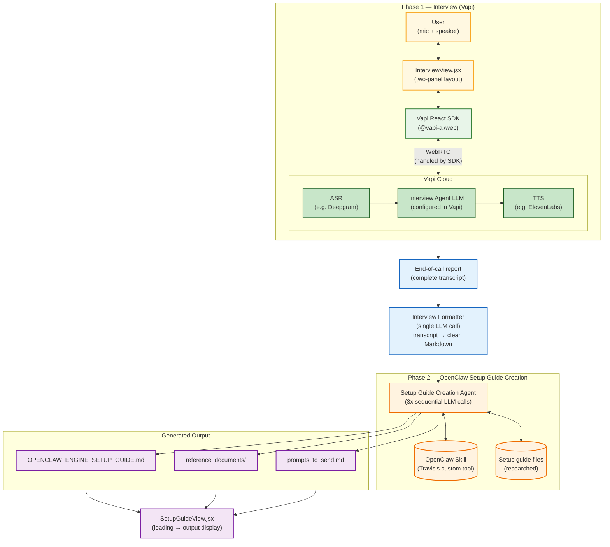

# OpenClaw Concierge — Technical Architecture

**Version:** 5.0 (2026-03-28)
**Authors:** Travis, Zi Cheng, Zixuan, James Zhao
**Voice layer:** [Vapi](https://vapi.ai/) (voice AI platform)
**See also:** [changelog-v5.md](changelog-v5.md) for detailed v5.0 changes

---

## 1. System Overview

OpenClaw Concierge is a **two-phase AI system** that interviews a user about their needs via voice and produces a personalized OpenClaw engine setup guide.

**Phase 1 (Interview)** uses **Vapi** for all voice infrastructure — ASR, TTS, streaming, interruption handling, turn-taking. The Vapi assistant (already built by the team) handles the conversation. Our frontend connects to Vapi via its React SDK and displays a two-panel UI.

**Phase 2 (Setup Guide Creation)** is a backend-only agent that takes the interview transcript and produces the output files.

### 1.1 High-level flow

```
User (voice) ↔ Vapi Cloud (ASR + TTS + turn-taking) ↔ LLM (Interview Agent)
                                ↓ transcript
                    [Regex Formatter — no API call]
                                ↓ clean Markdown
              [Python Context Gatherer — reads KB files directly]
                                ↓ transcript + all relevant KB context
              [Single Claude API Call — generates all output files]
                                ↓
              Output files → Frontend display (React + R3F + Framer Motion)
```

**There is no validation layer between phases.** The Interview Agent decides when it has enough information. The Formatter cleans ASR artifacts via regex. The guide generator produces output in a single API call with pre-gathered context.

### 1.2 What each phase does

| Phase | Agent | User interaction | Input | Output |
|-------|-------|-----------------|-------|--------|
| **Phase 1: Interview** | Vapi assistant (pre-built) | Yes — bi-directional voice via Vapi | User's spoken answers | Transcript (via Vapi's transcript events + end-of-call report) |
| **Formatter** | Regex cleanup (no API call) | None | Raw transcript | `INTERVIEW_TRANSCRIPT.md` (clean Markdown) |
| **Phase 2: Setup Guide Creation** | Single Claude API call with pre-gathered KB context | None — runs on backend while frontend shows loading UI | Formatted transcript + KB context | Setup guide + reference docs + prompts |

### 1.3 Why Vapi (not raw ADK BIDI streaming)

| Factor | Vapi | Raw ADK BIDI |
|--------|------|-------------|
| **Time to voice MVP** | 2-4 hours | 2-4 days |
| **Browser audio code** | Zero (SDK handles it) | ~400 lines (AudioWorklet, PCM, playback) |
| **WebSocket management** | Zero | ~200 lines |
| **ASR / TTS** | Handled (Deepgram, ElevenLabs, etc.) | Gemini native (less voice choice) |
| **Interruption / turn-taking** | Handled end-to-end | You relay and manage state |
| **Latency** | ~800ms-1.5s (ASR→LLM→TTS) | ~500ms-1s (native audio) |
| **Voice quality** | High (ElevenLabs, PlayHT) | Limited (Gemini voices) |

The team chose Vapi because the hackathon timeline doesn't allow 2-4 days on audio plumbing. The Vapi assistant is already built.

---

## 2. Phase 1: Interview Agent (Vapi)

### 2.1 Architecture

```
User (browser mic/speaker)
    ↕ WebRTC (Vapi SDK handles this)
Vapi Cloud
    ├── ASR: speech → text (configurable provider, e.g. Deepgram)
    ├── LLM: Interview Agent (configured in Vapi dashboard or via custom LLM endpoint)
    └── TTS: text → speech (configurable provider, e.g. ElevenLabs)
    ↕ Events (transcript, speech-start, speech-end, call-end)
Frontend (React — Vapi React SDK)
```

**No WebSocket code. No audio code. No ASR/TTS code.** Vapi handles all of this. The frontend uses `@vapi-ai/client-sdk-react` (or `@vapi-ai/web`) and listens to events.

### 2.2 Vapi integration points

| Component | How we use it |
|-----------|--------------|
| **Vapi Assistant** | Pre-built by team. Has assistant ID. Contains system prompt, LLM config, voice config, tool definitions. |
| **Vapi Public Key** | Needed in frontend to initialize the SDK |
| **`vapi.start(assistantId)`** | Starts the voice call from the browser |
| **`vapi.stop()`** | Ends the call |
| **`speech-start` event** | Triggers UI state: user or agent is speaking |
| **`speech-end` event** | Triggers UI state: speaker stopped |
| **`message` event** | Real-time transcript data (partial + final, with speaker role) |
| **`call-end` event** | Interview is over — trigger formatter + Phase 2 |
| **Server URL (webhook)** | If configured: Vapi POSTs events to our backend (transcript, function-call, end-of-call-report) |

### 2.3 Two possible LLM configurations

The Vapi assistant's "brain" can be set up in two ways:

**Option A: Vapi-managed LLM**
- The LLM (e.g., GPT-4, Claude, Gemini) is configured directly in the Vapi dashboard
- System prompt and tools are set in Vapi's assistant config
- Our server only receives webhook events (transcripts, function calls, end-of-call)

**Option B: Custom LLM endpoint**
- Vapi is configured with `provider: "custom-llm"` pointing to our server
- Vapi handles ASR → sends text to our HTTP endpoint → we return text → Vapi handles TTS
- Our server runs the agent logic (could be ADK text mode, LangChain, direct API, etc.)
- More control over the agent, but requires a deployed HTTP endpoint

**Which one the team used depends on the Vapi assistant configuration — ask your teammate.**

### 2.4 Interview Agent knowledge base (other team's responsibility)

The Interview Agent's system prompt, knowledge base, and conversational behavior are provided by another team:

- **System prompt** — conversation flow, decision logic, filler phrase handling
- **Domain knowledge** (`domain_knowledge/`) — industry folders + combined use cases file
- **Skill registry** (`skill_registry.md`) — accessed via tool-based lookup

This is configured either in the Vapi assistant dashboard (if Option A) or in our custom LLM endpoint (if Option B).

### 2.5 Streaming and interruption

Vapi handles all of this natively:
- **Streaming is always on** — audio flows continuously between user and Vapi
- **Interruption (barge-in):** Vapi detects when the user speaks during agent output, cuts off the agent's audio, and restarts with updated context
- **Turn-taking:** Vapi's VAD (Voice Activity Detection) and endpointing model predict when the user is done speaking
- **The user can always talk** — there is no gating or muting

### 2.6 Getting the transcript

The transcript for the Formatter comes from Vapi in two ways:

1. **Real-time `message` events** — used for the live transcript UI display during the interview
2. **End-of-call report** — Vapi sends a complete transcript when the call ends (via webhook to server URL, or accessible via Vapi API)

We use (1) for the UI and (2) as the input to the Formatter.

### 2.7 Session lifecycle

- The Interview Agent (via Vapi) decides when the conversation has enough information and ends the call
- There is **no mechanism for the user to go back** in conversation turns
- **Pause/resume is deferred to post-MVP**
- If the user closes the browser, the Vapi call ends and the session is lost

---

## 3. Interview Formatter

Regex-based cleanup (no API call) that sits between the two phases.

**Input:** Complete interview transcript from Vapi's end-of-call report
**Output:** `INTERVIEW_TRANSCRIPT.md` — clean, well-formatted Markdown

**Rules:**
- No intent changes — purely grammar cleanup, formatting, and parsing
- Preserves all user statements and agent responses
- Bolds speaker labels, removes ASR filler words (um, uh, like), collapses stutters

**Implementation:** Regex-based (`formatter.py:_regex_fallback`). LLM-based formatters (Gemini Flash, Claude Haiku) still exist in code but are bypassed — the single-pass guide agent handles messy transcripts fine without pre-cleaning.

---

## 4. Phase 2: Setup Guide Creation (Single-Pass)

### 4.1 How it runs

This runs entirely on the **backend** — the user does not interact with it. While it runs, the frontend displays a loading UI with the 3D claw mascot. Expected duration: **30-60 seconds** (single API call).

**Input:** Formatted transcript + pre-gathered KB context

### 4.2 Context gathering (Python, no API calls)

Python analyzes the transcript for keywords and loads relevant KB files directly:

| Signal | Detection | Files loaded |
|--------|-----------|-------------|
| Deployment | "mac mini", "docker", "vps", "mac" | Matching setup guide (6-29KB) |
| Channel | "telegram", "whatsapp", "discord", etc. | Channel docs (4KB) |
| Industry | "dental", "restaurant", "developer", etc. | Domain knowledge file (3KB) |
| Tools | "gmail", "crm", "dentrix", etc. | Skill registry grep results |
| Always | — | Cron docs, security docs, template |

Optional: KB semantic search adds 3 supplementary docs via FAISS (keyword fallback if Gemini unavailable).

### 4.3 Output files

| Output | Description |
|--------|-------------|
| `EASYCLAW_SETUP.md` | The main setup guide. 6-phase structure. ~20K chars. |
| `prompts_to_send.md` | 6 copy-paste prompts for OpenClaw initialization. ~8K chars. |
| `reference_documents/*.md` | Optional sub-docs for complex procedures. |

### 4.4 Pipeline orchestration (Direct Anthropic API)

**One API call** with all context pre-gathered:

```
[Python context gatherer]
    ├── Transcript keywords → deployment, channel, industry
    ├── Loads setup guide, channel docs, industry knowledge
    ├── Greps skill registry for relevant skills
    ├── Loads cron, security, template docs
    └── Optional: FAISS/keyword KB search
         ↓
[Single Claude API call]
    System: ~1,200 token prompt (6-phase structure + style rules)
    User: transcript + all KB context (~20K tokens)
    Response: <file> tagged output parsed into separate files
         ↓
[Parse + write files to disk]
```

**Performance:** 1 API call, ~$0.14, ~30-60s. No multi-turn loop, no quality eval, no patch step.

**Rate limiting:** Built-in retry with 20/40/60s backoff for 429 errors.

---

## 5. Project Structure

```
backend/
├── main.py                       # FastAPI server + in-memory guide store
│                                  #   - POST /webhook — Vapi server URL (receives events)
│                                  #   - POST /format — triggers formatter pipeline
│                                  #   - POST /generate-guide — triggers guide pipeline
│                                  #   - GET /guide/:id — retrieve generated output
├── setup_guide_agent/
│   ├── __init__.py
│   ├── agent.py                  # Claude Agent SDK orchestration (guide + refdocs + prompts)
│   └── context/                  # Knowledge base (domain knowledge, openclaw-docs, templates)
├── formatter.py                  # Interview transcript formatter (single LLM call)
└── vapi_config.py                # Vapi assistant ID, public key, webhook handling

frontend/
├── src/
│   ├── App.jsx                   # Route between Interview and Setup Guide views
│   ├── InterviewView.jsx         # Two-panel: agent presence (left) + transcript (right)
│   ├── SetupGuideView.jsx        # Loading UI → rendered output
│   ├── useVapi.js                # Vapi SDK hook (start/stop call, listen to events)
│   └── components/
│       ├── AgentPresence.jsx     # Avatar PNGs (listening/thinking/talking) + animated mic circle
│       ├── Transcript.jsx        # Live transcript fed by Vapi message events
│       ├── LoadingScreen.jsx     # Phase 2 waiting state
│       └── OutputDisplay.jsx     # Rendered Markdown + copy buttons + download
├── public/
│   ├── agent_listening_avatar.png  # Avatar for listening/idle state
│   ├── agent_thinking_avatar.png   # Avatar for thinking state
│   └── agent_talking_avatar.png    # Avatar for talking state
├── package.json                  # Dependencies: @vapi-ai/web or @vapi-ai/client-sdk-react
└── vite.config.js

docs/
├── architecture.md                # This file
├── design-considerations.md
└── diagrams/
    ├── system-flow.mmd
    └── system-flow.png

AGENTS.md                          # AI coding agent instructions (root)
```

### 5.1 Tech stack

- **Frontend:** React 18 + Vite + Tailwind, Vapi React SDK (`@vapi-ai/web`), Framer Motion, React Three Fiber + drei (3D claw)
- **Backend:** FastAPI (HTTP only, no WebSocket), Anthropic Python SDK (direct API, no CLI)
- **Voice:** Vapi (ASR, TTS, streaming, interruption — all handled externally)
- **KB Search:** FAISS + Gemini embeddings (with keyword fallback)

---

## 6. Frontend Architecture

### 6.1 Three UI states

**State 1: Interview (Phase 1)**
- Two-panel layout: agent presence (left) + live transcript (right)
- Left panel: three PNG avatars (listening/thinking/talking) that swap based on Vapi events + animated mic circle
- Right panel: scrolling transcript fed by Vapi `message` events
- `speech-start` / `speech-end` events drive the avatar swap and mic circle animation

**State 2: Loading (Phase 2 in progress)**
- Full-screen loading state
- "Generating your OpenClaw Setup Guide..." messaging
- Progress indicator (spinner or progress bar)
- Estimated wait time (~5 minutes)

**State 3: Output (Phase 2 complete)**
- Three sections: main guide, reference documents, prompts to send
- Rendered Markdown with syntax highlighting
- Copy buttons on code blocks and prompts
- Download buttons (individual `.md` files + full zip)

### 6.2 Voice state machine (Interview phase)

| State | Avatar | Mic circle | Vapi event trigger |
|-------|--------|-----------|-------------------|
| **Idle** | Listening PNG | Neutral ring | No `speech-start` events |
| **User speaking** | Listening PNG | Green pulsing waveform | `speech-start` (from user) |
| **Agent thinking** | Talking PNG | Animated dots / breathing pulse | User `speech-end` → waiting for agent `speech-start` |
| **Agent speaking** | Talking PNG | Blue waveform | `speech-start` (from agent) |

The user can interrupt at any time — Vapi handles barge-in. The UI transitions based on Vapi SDK events.

### 6.3 Vapi React integration (minimal code)

```jsx
import Vapi from "@vapi-ai/web";

const vapi = new Vapi(VAPI_PUBLIC_KEY);

// Start interview
vapi.start(VAPI_ASSISTANT_ID);

// Listen to events
vapi.on("speech-start", () => { /* update UI state */ });
vapi.on("speech-end", () => { /* update UI state */ });
vapi.on("message", (msg) => { /* append to transcript */ });
vapi.on("call-end", () => { /* trigger formatter + Phase 2 */ });

// End interview
vapi.stop();
```

That's it for the voice integration. No WebSocket. No audio code.

---

## 7. Backend Architecture

### 7.1 Endpoints

| Method | Path | Purpose |
|--------|------|---------|
| `POST` | `/webhook` | Vapi server URL — receives transcript events, function-call requests, end-of-call report |
| `POST` | `/format` | Triggers the Interview Formatter on a transcript |
| `POST` | `/generate-guide` | Triggers Phase 2 (Setup Guide Creation Agent) |
| `GET` | `/guide/:id` | Retrieve generated output (guide + reference docs + prompts) |

### 7.2 Vapi webhook events we handle

| Event | What we do |
|-------|-----------|
| `transcript` | Store/forward real-time transcript (optional — frontend gets this directly from SDK too) |
| `function-call` | Execute tool call and return result (if Vapi assistant has tools configured) |
| `end-of-call-report` | Store final transcript → trigger Formatter → trigger Phase 2 |
| `assistant-request` | (Optional) Dynamically configure the assistant per call |

### 7.3 Server URL setup

The Vapi assistant needs a **Server URL** pointing to our backend's `/webhook` endpoint. This must be publicly accessible (use ngrok for local dev, deployed URL for production).

---

## 8. Security Model

### 8.1 Zero API key storage

The system **never** stores user API keys. OAuth and Codex authentication flows are user-side only.

### 8.2 Tiered transparency

| Tier | Description | Guide behavior |
|------|-------------|---------------|
| **Tier 1** (Easy) | Full setup; user signs in (OAuth) | Complete `clawhub install` commands |
| **Tier 2** (Medium) | Config provided, manual steps needed | Commands + manual step callouts |
| **Tier 3** (Advanced) | Complex setup | Links + explanation |

### 8.3 Skill registry integrity

All `clawhub install <slug>` commands come from the **skill registry** via tool-based lookup. The LLM never invents slugs.

### 8.4 Vapi security

- Vapi Public Key is safe to expose in frontend (it's a publishable key)
- Vapi Private Key (if needed for API calls) stays in backend only
- Webhook endpoint should validate Vapi's request signatures in production

---

## 9. Data Flow Diagram



---

## 10. Vapi Setup Checklist

**Required from teammate who built the Vapi assistant:**

- [ ] Vapi Assistant ID
- [ ] Vapi Public Key (for frontend SDK)
- [ ] LLM configuration: built-in (Vapi-managed) or custom endpoint?
- [ ] If custom endpoint: server URL, expected format, deployment status
- [ ] Server URL configured in Vapi? (for webhooks)
- [ ] ASR provider and settings
- [ ] TTS provider and voice
- [ ] Tools/functions configured? If so, which ones?
- [ ] Vapi plan (free trial / pay-as-you-go / enterprise)

**Optional / nice-to-have:**
- [ ] Squad configured? (multi-assistant)
- [ ] Custom VAD / interruption settings
- [ ] Language settings

---

---

*Architecture v5.0 — 2026-03-28. Single-pass guide generation, frontend redesign with 3D claw, removed Claude Agent SDK dependency.*
